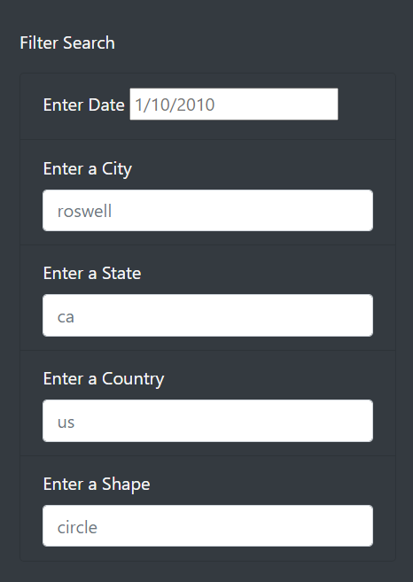

# UFOs
## Overview of the Analysis
The purpose of this analysis was to develop a html site which filtered UFO sightings by date and location. The given data set was filled with UFO sightings with certain descriptions, such as date and location, and by inputting certain constraints the data was sorted and condensed to match the input.

## Results

## Summary
